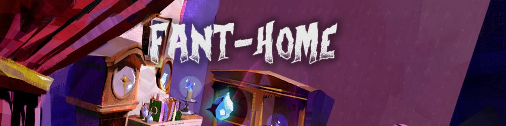

## 📝 About

Fant-Home is a twin-stick shooter.  
You play as a ghost hunter vehicle and survive waves of aggressive ghosts to win.

## 🏎️ Main feature

I had the opportunity to learn behavior trees to add to this project.  
In fact, most of the enemies have a behavior tree that responds to rules that we've set up beforehand.  
Using this method enabled me to prioritize the importance of the behaviors that the enemies must perform. 

## 💼 What I've done

| Name             | Description                       |
| :--------------: | :-------------------------------: |
| AI Behavior Tree | Development of AI enemies         |
| Debug            | Debugging problems and playtesting |
| Linking AI       | Integrate enemies and link them to waves |
| Integration      | Take care of integrating artists' assets |

## 🔗 Links

